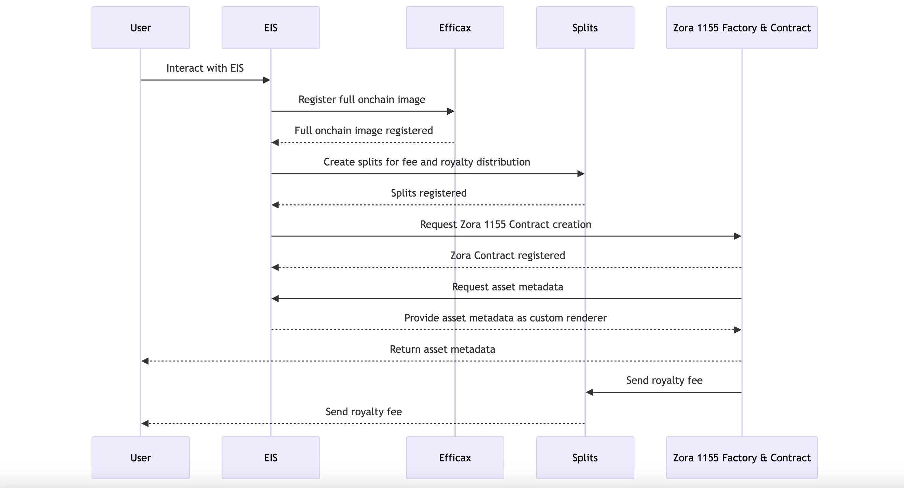

# EIS

## Technical Challenges

### Full onchain image registration

- EIS registers very large images, and we conducted extensive research on onchain image compression/decompression and SSTORE2
- We discovered that the Efficax contract is a suitable contract for forking
- However, Efficax is implemented with the Manifold contract, so we forked and adapted it to work with the Zora contract
- Currently, image data exceeding 100kb can be registered in the EIS contract

### Fee streaming

- To establish fee streaming for Remix asset creation, we utilized splits
- Splits require management of the distribution flow and withdrawal process, which necessitated extensive testing to ensure functionality
- Now we have flexible royalty streaming with splits

### Zora Integration

- Integrated EIS full onchain image with Zora Contract as a custom metadata renderer and splits as a royalty recipient

- Initially, the image was not displayed on the Zora platform due to:

  - Zora testnet web app not functioning properly on Base Sepolia, but it was found to work well on the Zora testnet
  - Zora contract needing to emit a URI event to prompt the indexer to fetch the data, which we implemented

- Now we have successfully integrated and tested here
  https://testnet.zora.co/collect/zsep:0x6cd915072796ad62ff4614d6caa436e6354450b6

## Technology Used

- Zora Contracts for ERC1155 contract and factory
- Efficax for full onchain image registration
- Splits for fee streaming for creators
- ERC-4883 for Composable NFT
- The Graph for artwork curation
- OnchainKit
- Coinbase Onchain Verification
- Rainbowkit SDK for Coinbase Smart Walle

## Base Integraion

TBD
